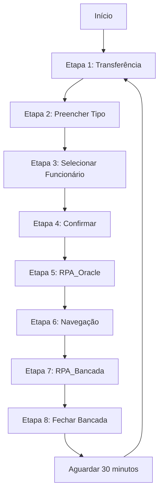

# RPA Ciclo - Automação de Ciclo Completo

Sistema de automação que orquestra a execução sequencial de processos no Oracle, incluindo transferência de subinventário, execução do RPA_Oracle e RPA_Bancada.

## 🆕 Versão com Interface Gráfica e Executável Standalone

**Novidades:**
- ✅ **Interface gráfica** amigável e intuitiva
- ✅ **Executável standalone** - não precisa instalar Python
- ✅ **Integração com Google Sheets** - logs automáticos
- ✅ **Dois modos de execução** - único ou contínuo
- ✅ **Todas as imagens incluídas** no executável

## 📋 Descrição

O RPA Ciclo executa automaticamente a seguinte sequência de operações:

1. **Transferência de Subinventário** - Abre a tela de transferência
2. **Preenchimento do Tipo** - Insere "SUB" no campo tipo
3. **Seleção de Funcionário** - Seleciona "Wallatas Moreira"
4. **Confirmação** - Clica em "Sim" para confirmar
5. **Execução do RPA_Oracle** - Executa o robô Oracle completo
6. **Navegação** - Navega para "1 - Navegador - TPC BR COMP BC2 INV USER"
7. **Abertura da Bancada** - Abre "4. Bancada de Material"
8. **Execução do RPA_Bancada** - Executa o robô Bancada completo
9. **Fechamento** - Fecha a janela da Bancada
10. **Aguarda 30 minutos** - Intervalo antes de repetir o ciclo

## 🔧 Requisitos

### Python
- Python 3.8 ou superior

### Dependências
```
pyautogui
keyboard
```

### Estrutura de Diretórios
```
rpas/
├── rpa_ciclo/
│   ├── main.py                      # Script legado (linha de comando)
│   ├── main_ciclo.py                # Módulo principal (para GUI)
│   ├── RPA_Ciclo_GUI.py             # Interface gráfica ⭐
│   ├── google_sheets_ciclo.py       # Integração Google Sheets
│   ├── config.json                  # Configurações
│   ├── RPA_Ciclo.spec               # Configuração PyInstaller
│   ├── build.bat                    # Script de build ⭐
│   ├── requirements.txt             # Dependências
│   ├── README.md                    # Este arquivo
│   ├── MANUAL_USO.md                # Manual do executável ⭐
│   ├── mouse_position_helper.py     # Helper para coordenadas
│   ├── Logo.png                     # Logo Genesys
│   ├── Logo.ico                     # Ícone do executável
│   ├── Tecumseh.png                 # Logo Tecumseh
│   ├── Topo.png                     # Ícone da janela
│   ├── CredenciaisOracle.json       # Credenciais Google OAuth
│   └── informacoes/                 # Imagens de referência
│       ├── tela-01-744x298.jpg
│       ├── tela-02-155x217-tab-enter.jpg
│       ├── tela-03-32x120.jpg
│       ├── tela-04-577x616-doubleclick.jpg
│       ├── tela-05-765x635.jpg
│       ├── tela-06-2-345x180.jpg
│       ├── tela-06-376x267.jpg
│       ├── tela-07-737x351-doubleclick.jpg
│       └── tela-08-754x97.jpg
├── rpa_oracle/
│   └── RPA_Oracle.py
└── rpa_bancada/
    └── main.py
```

⭐ = Novos arquivos da versão com GUI

## 📦 Instalação

1. Clone ou copie o projeto para seu computador

2. Instale as dependências:
```bash
pip install -r requirements.txt
```

3. Verifique se os caminhos dos outros RPAs estão corretos no `config.json`

## ⚙️ Configuração

### config.json

O arquivo `config.json` contém todas as configurações do RPA:

#### Coordenadas
Todas as coordenadas de clique estão definidas no arquivo. Caso as coordenadas não funcionem corretamente, você pode ajustá-las:

```json
{
  "coordenadas": {
    "tela_01_transferencia_subinventario": {
      "x": 744,
      "y": 298,
      "descricao": "Clique na opção Transferência de Subinventário"
    },
    ...
  }
}
```

#### Tempos de Espera
Você pode ajustar os tempos de espera entre as ações:

```json
{
  "tempos_espera": {
    "entre_cliques": 1.5,        // Tempo entre cliques (segundos)
    "apos_modal": 2.0,            // Tempo após abrir modal (segundos)
    "apos_rpa_oracle": 3.0,       // Tempo após RPA_Oracle (segundos)
    "apos_rpa_bancada": 3.0,      // Tempo após RPA_Bancada (segundos)
    "ciclo_completo": 1800        // Intervalo entre ciclos (30 min)
  }
}
```

## 🚀 Execução

### Opção 1: Interface Gráfica (Recomendado)

**Executar com Python:**
```bash
python RPA_Ciclo_GUI.py
```

**Ou usar o executável standalone:**
1. Gere o executável:
   ```bash
   build.bat
   ```
2. Execute `dist\RPA_Ciclo.exe`

**Vantagens da Interface Gráfica:**
- ✅ Fácil de usar
- ✅ Visualização de logs em tempo real
- ✅ Controles simples (Iniciar/Parar)
- ✅ Dois modos: Ciclo Único ou Modo Contínuo
- ✅ Acesso direto ao Google Sheets

### Opção 2: Linha de Comando (Avançado)
Execute o script principal:
```bash
python main.py          # Modo linha de comando (legado)
python main_ciclo.py    # Versão refatorada para GUI
```

### Durante a Execução

O RPA irá:
- Registrar todas as ações no arquivo `rpa_ciclo.log`
- Exibir o progresso no console
- Aguardar entrada manual durante a execução do RPA_Oracle

### Controles

- **ESC**: Pausa o RPA a qualquer momento
- **Ctrl+C**: Interrompe completamente o RPA
- **PyAutoGUI FAILSAFE**: Mova o mouse para o canto superior esquerdo para parar

## 📊 Logs

Todos os eventos são registrados em:
- **Console**: Output em tempo real
- **Arquivo**: `rpa_ciclo.log` com histórico completo

Formato do log:
```
2025-10-09 12:34:56 - INFO - 🔄 INICIANDO CICLO #1
2025-10-09 12:34:56 - INFO - 📋 ETAPA 1: Transferência de Subinventário
2025-10-09 12:34:57 - INFO - 🖱️ Clique na opção Transferência de Subinventário
...
```

## 🔄 Fluxo de Execução



## ⚠️ Observações Importantes

### RPA_Oracle
O RPA_Oracle possui interface gráfica própria (Tkinter). Durante a execução do ciclo:
1. O script irá pausar e aguardar você iniciar o RPA_Oracle manualmente
2. Execute o RPA_Oracle e aguarde sua conclusão
3. Pressione **ENTER** no console do RPA_Ciclo para continuar

**Alternativa**: Você pode modificar a etapa 5 no `main.py` para executar o RPA_Oracle de forma diferente, se necessário.

### RPA_Bancada
O RPA_Bancada é executado automaticamente como subprocesso. Certifique-se de que:
- O arquivo `main.py` existe em `../rpa_bancada/`
- As dependências do RPA_Bancada estão instaladas
- O RPA_Bancada está configurado corretamente

### Coordenadas de Tela
As coordenadas são baseadas nas imagens de referência em `informacoes/`. Se a resolução ou escala da tela mudar, você precisará ajustar as coordenadas no `config.json`.

### Resolução Recomendada
- As coordenadas foram configuradas para uma resolução específica
- Verifique se a janela do Oracle está maximizada
- Não mova ou redimensione janelas durante a execução

## 🐛 Solução de Problemas

### O RPA clica no lugar errado
- Verifique a resolução da tela
- Ajuste as coordenadas no `config.json`
- Compare com as imagens de referência em `informacoes/`

### RPA_Oracle não executa
- Verifique o caminho em `config.json`
- Certifique-se de que o arquivo existe
- Tente executar manualmente primeiro

### RPA_Bancada falha
- Verifique os logs em `rpa_ciclo.log`
- Execute o RPA_Bancada separadamente para testar
- Verifique as dependências

### Ciclo não repete
- Verifique o campo `ciclo_completo` em `config.json`
- Confirme que não há erros nos logs
- Verifique se o ESC não foi pressionado acidentalmente

## 📝 Manutenção

### Atualizar Coordenadas
1. Tire screenshots das telas
2. Use uma ferramenta para identificar coordenadas (ex: mouse.py)
3. Atualize o `config.json`
4. Teste cada etapa individualmente

### Ajustar Tempos
Se o sistema estiver muito rápido ou lento:
1. Ajuste os valores em `tempos_espera`
2. Aumente para sistemas mais lentos
3. Diminua para otimizar sistemas rápidos

### Modificar Fluxo
Para adicionar ou remover etapas:
1. Edite a lista `etapas` na função `executar_ciclo_completo()`
2. Crie novas funções `etapa_XX_...()` seguindo o padrão
3. Atualize a documentação

## ☁️ Google Sheets Integration

### Configuração Automática
Na primeira execução, o RPA irá:
1. Solicitar login no Google (navegador abre automaticamente)
2. Criar a aba "Ciclo Automacao" na planilha
3. Gerar o arquivo `token.json` para próximas execuções

### Dados Registrados
Cada ciclo registra:
- Data/Hora Início e Fim
- Número do Ciclo
- Status (Sucesso/Falha/Pausado)
- Etapa que falhou (se houver)
- Tempo de execução
- Status do RPA Oracle
- Status do RPA Bancada

### Planilha
- **ID**: 14yUMc12iCQxqVzGTBvY6g9bIFfMhaQZ26ydJk_4ZeDk
- **Aba**: Ciclo Automacao
- **Acesso**: Via botão "☁️ Google Sheets" na interface

## 🔨 Gerar Executável Standalone

### Passo a Passo

1. **Instale as dependências:**
   ```bash
   pip install -r requirements.txt
   ```

2. **Execute o script de build:**
   ```bash
   build.bat
   ```

3. **Aguarde o processo:**
   - Instalação do PyInstaller (se necessário)
   - Instalação de dependências
   - Limpeza de builds anteriores
   - Geração do executável
   - Cópia de arquivos necessários

4. **Resultado:**
   - Executável: `dist\RPA_Ciclo.exe`
   - Tamanho aproximado: 50-100 MB
   - Inclui todas as imagens e recursos

### Distribuição

Para distribuir, copie a pasta `dist` contendo:
- `RPA_Ciclo.exe`
- `CredenciaisOracle.json`
- Arquivo `LEIA-ME.txt` (criado automaticamente)

**⚠️ Importante:**
- O usuário final não precisa ter Python instalado
- Na primeira execução, será necessário fazer login no Google
- Um arquivo `token.json` será criado após o login

## 📚 Documentação Adicional

- **MANUAL_USO.md** - Manual completo do executável
- **config.json** - Documentação inline das configurações
- **Ajuda na Interface** - Clique em "❓ Ajuda" no executável

## 📄 Licença

Este projeto é de uso interno.

## 👥 Suporte

Para problemas ou dúvidas:
1. **Consulte o manual:** MANUAL_USO.md
2. **Verifique os logs:** rpa_ciclo.log
3. **Clique em Ajuda:** Botão "❓" na interface
4. **Solução de Problemas:** Seção Troubleshooting no README
5. **Contato:** Equipe de desenvolvimento

---

**Versão**: 2.0.0
**Última atualização**: 2025-10-09
**Com Interface Gráfica**: ✅
**Executável Standalone**: ✅
**Google Sheets Integration**: ✅
